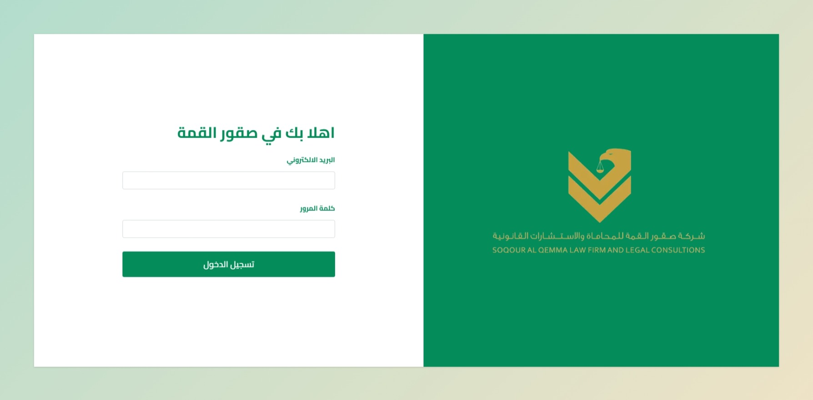
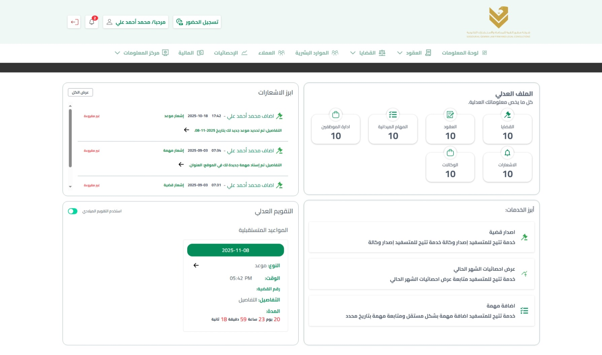

---

# Soqour Al Qemma ERP & CRM — Production Case Study

Full-stack ERP & CRM system designed for a legal firm to automate operations, manage cases, clients, HR, finance, and reporting in a unified digital platform.

---

## 📑 Table of Contents

- [🚀 Project Overview](#-project-overview)
- [✨ Key Features](#-key-features)
- [🧠 System Modules & Structure](#-system-modules--structure)
- [🧳 Technologies](#-technologies)
- [📸 Screenshots](#-screenshots)
- [🌍 Live System](#-live-system)
- [📌 Project Information](#-project-information)
- [📈 Project Impact](#-project-impact)
- [🔒 Source Code](#-source-code)
- [📬 Contact Information](#-contact-information)

---

## 🚀 Project Overview

Soqour Al Qemma ERP & CRM is a fully integrated internal management system built for a legal firm to digitize and automate all operational processes.

The system replaces manual workflows with a centralized platform covering contracts, cases, HR, finance, scheduling, reporting, and client management.

It was built with a strong focus on automation, data accuracy, Arabic RTL support, and real-time operational visibility.

---

## ✨ Key Features

- Full ERP & CRM integration in a single platform
- Role-Based Access Control (Admin, HR, Lawyer, Accountant)
- Real-time dashboards with KPIs and analytics
- Contract Management system
- Cases & Legal Judgements tracking
- HR module (attendance, leaves, employees)
- Finance module (payments, invoices, expenses)
- Client (CRM) management system
- Notifications system (internal alerts)
- Calendar & scheduling system
- Advanced search and filtering system
- Export reports (Excel / HTML)
- Fully responsive RTL interface
- Secure authentication system

---

## 🧠 System Modules & Structure

### ⚖️ Legal Modules

- Contracts Management
- Items Management
  - Financial Terms
  - First Party Obligations
  - Second Party Obligations
- Agencies Management
- Cases Management
- Execution Cases
- Courts
- Judgements
- Sessions

### 👨‍💼 HR Modules

- Employees
  - Details
  - Contract
  - Vacations
  - Attendance and Departure
  - Salaries
  - Advances
  - Outgoing Advances
  - Bonuses
  - Outgoing Bonuses
  - Deductions
  - Warnings
  - Licenses
  - Assignments
  - Case Contracts
- Employee Contracts
- Marketers
- Add Jobs
- Today's Attendance
- Attendance and Departure
- Vacations
- Overlapping Vacations
- Salaries
- Salaries Issued
- Salaries Paid
- Advances
- Advances Issued
- Bonuses
- Bonuses Issued
- Deductions
- Warnings
- Licenses
- Tasks
- Comprehensive Reports
- Sessions and Tasks
- Latest
- Roles & Permissions

### 👥 CRM Modules

- Clients
- Opponents
- Communication Tracking
- Phone calls
- Appointments
- Field assignments
- Office visits

### 💰 Finance Modules

- Expenses
- Revenues
- Salaries
  - Issued
  - Paid
  - Upcoming
  - Recurring Monthly
- Advances
  - Outgoing
  - Received
- Bonuses
  - Outgoing
  - Received
- Financial Reports
- Contracts
- Treasury
- Installments
  - Installments
  - Installments Due

### 📊 Dashboard & Analytics

- Manager's Panel
  - Total Contracts
  - Total cases
  - Sessions
  - installments due
  - Treasury balance
  - Staff and field tasks
  - Office visits
  - Rewards, discounts, and advances
  - Income and expenses (this month / previous month)
  - Distribution of cases by outcome
  - Status of field missions
  - Distributing cases among supervisors
  - Court rulings statistics
  - Monthly workload for employees
- Finance and Treasury
  - Current Treasury Balance
  - Total income (month)
  - Total exports (month)
  - Net (Income - Export)
  - Comparing revenues and expenses (current month/previous month)
  - installments
  - Clients
  - Salaries and bonuses (monthly)
- Employee performance evaluation
  - Employee-related issues
  - Sessions
  - Pre-booked visits
  - Status of field tasks
  - Field tasks
  - Office visits
  - General performance indicator (from current data)
  - Additional digital summary
  - Comparing sessions (this month / last month)
  - Distribution of field assignment cases

### Calendar

Session - Field Assignments - Appointment - Office visits

- Day
- Week
- Month

### Notifications

- General notice
- Case notice
- Session notice
- Appointment notice
- Visit notice

---

## 🧳 Technologies

- React.js
- Next.js
- TypeScript
- Tailwind CSS
- Redux Toolkit
- React Query
- Chart.js
- FullCalendar
- Axios
- React Hook Form

---

## 📸 Screenshots

---

## 🌍 Live System

https://soqour-al-qemma.vercel.app

👉 View full case study on my website:  
https://mahmoudabuyoussef.com/projects/erp-crm-for-soqour-al-qemma

---

## 📌 Project Information

| Field        | Details                          |
| ------------ | -------------------------------- |
| Project Type | ERP & CRM System                 |
| Industry     | Legal / Law Firm                 |
| Role         | Front-End Developer Team Lead    |
| Stack        | Full-Stack (Next.js + .Net core) |
| Duration     | 6 Months                         |
| Status       | Production                       |
| Year         | 2025                             |

---

## 📈 Project Impact

- Fully automated legal operations (100%)
- Reduced manual work and human errors by 70%+
- Improved case tracking and client management
- Enabled real-time financial visibility
- Centralized all firm operations in one system
- Improved decision-making through analytics dashboards
- Increased operational efficiency significantly

---

## 🔒 Source Code

This project was developed for a real production environment.

The source code is private and not publicly available due to client and production restrictions.

This repository is intended for project presentation and case study purposes only.

---

## 📬 Contact Information

If you'd like to collaborate, discuss a project, or hire me for development work:

- 📧 Email: contact@mahmoudabuyoussef.com
- 💼 LinkedIn: https://www.linkedin.com/in/mahmoudabuyoussef
- 🌐 website: https://mahmoudabuyoussef.com
- 🐙 GitHub: https://github.com/mahmoud-abuyoussef
